# ExportToExcel_Alternativo

## Resumen
Sirve para manipular y exportar el contenido de los datos de cada columna de grillas de Engage. Tal función sirve para grillas de tipo **Tabla**, **Grilla** y **Grilla Filtrada**, ademas se puede usar junto con los **BuildAjax...**

Invocación de la función:
```javascript
ExportToExcel(gridIndex, opts);
```
### gridIndex 
Es el orden secuencial de la grilla a exportar _(como usa el ExportToExcel original)_.
```javascript
ExportToExcel(0);
ExportToExcel(1);
ExportToExcel(2);
```

### opts
Este parametro opcional es un objeto js que tiene 2 atributos:
```javascript
{ // Ejemplo
  deny: [1,3,9],
  edit: [[2, GetTooltip], [5, GetTooltip]]
}
```
#### deny
Es un array numérico que representa las columnas que no seran exportadas.
#### edit
Es un array de arrays que edita/modifica el contenido de la celda en toda una o varias columnas específicas y/o quitar columnas.
Dentro del sub-array tiene que estar el número de la columna y el nombre de la funcion transformadora.  
Las funciones deben tener un parametro de entrada que sera el elemento `<td>...</td>`. No necesariamente deben devolver un resultado ya que es una operación mutable que hace dentro. Por ejemplo las funciones debe ser de este estilo:  
```javascript 
function NombreFuncion(td){
    // code...
}
```
#### Funciones predefinidas para edit _(se agregaran mas a futuro si son necesarios)_
- **GetTooltip**: reemplazara el innerHTML por el atributo **title** (si existe) del elemento hijo del `<td>` (celda).
- **RemoveImage**: removera las imagenes que esten dentro del `<td>` (celda) si es que existe.  

## Uso típico
Usualmente se quiere mostrar **X grillas separadas** en pantalla y brindar la posibilidad de exportar los datos. Cada uno tendra su boton o icono para exportarlo. Las grillas pueden ser de tipo Tabla, Grilla y Grilla Filtrada. Pero muchas veces las grillas traen imagenes, iconos, radio-buttons, checkbox o textos acotados con tooltip incorporados.
Si exportamos de la forma tradicional, apareceran imagenes rotas en el excel, ej:  
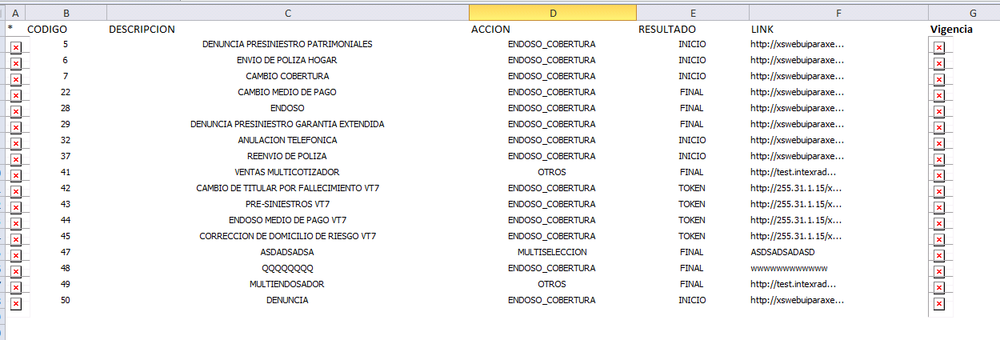

### Pasos
1. Copiar y pegar el archivo `/src/ExportToExcel_Alternativo.js` en la carpeta `Contenidos`.
2. Poner un elemento **Tabla del Designer** en la pantalla. Setearle la ejecucion de un Stored Procedure.  
3. Agregar un elemento **Html** y escribir la referencia del archivo js de arriba.  
`<script src="./../Contenidos/ExportToExcel_Alternativo.js"></script>`
4. Agregar otro elemento **Html** y dentro escribir alguna etiqueta con la **invocación de la función**.
5. Validar el trámite y limpiar la cache del navegador.

### Invocación de la función
Por ejemplo, queremos exportar esta grilla de tipo Tabla.  
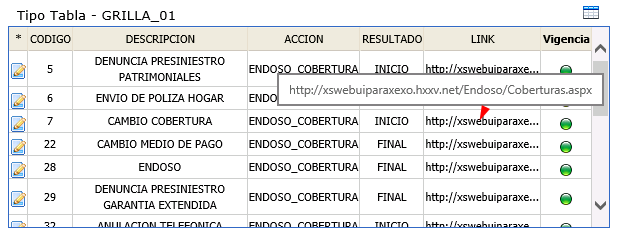  
Esta grilla tiene la columna 1 y 7 con imagenes, y la columna 6 y 7 con <b title="Los tooltips son utiles para no mostrar todo el texto en la pantalla">tooltips</b>. Lo que vamos hacer es remover la columna 1 y mostrar el atributo title (si existe) de la columna 6 y 7. Para eso en el 2do parametro de la función pasaremos:
```javascript
{
  deny: [1],
  edit: [[6,GetTooltip],[7,GetTooltip]]
}
```
La etiqueta con la invocación quedaria de esta forma:

```html

```
Finalmente, la grilla exportada quedaria así:
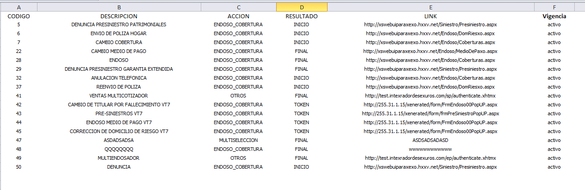  
Los links se muestran completos, la 1ra columna se omitió y la imagen de vigencia se mapeo a texto. :+1:
<br/>
<br/>


## Uso Avanzado (BuildAjaxTable, BuildAjaxGrid, BuildAjaxFilteredGrid)
Cuando un grupo de grillas se cargan por medio de Ajax, las **opts** de cada uno pueden variar.  
Por ejemplo, vamos a integrar 3 grillas de tipo grilla filtrada con el BuildAjaxFilteredGrid:
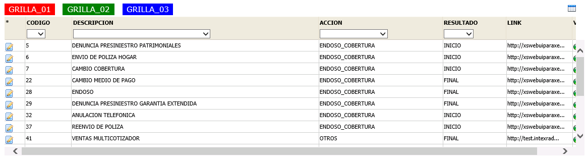<br/>
Cada grilla muestra estos datos:  
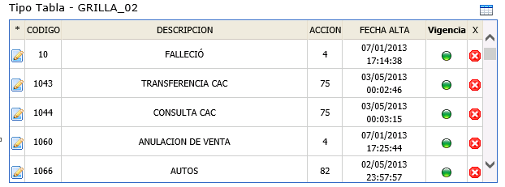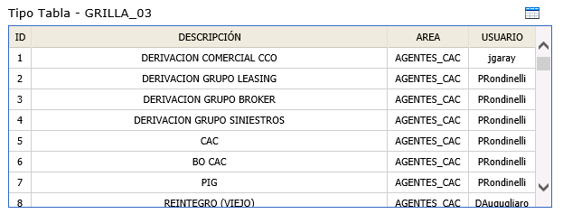<br/>

### Pasos
1. Copiar y pegar el archivo `/src/ExportToExcel_Alternativo.js` en la carpeta `Contenidos`.
2. Poner un elemento **Tabla del Designer** en la pantalla. Setearle la ejecucion de un Stored Procedure por default.  
3. Agregar un elemento html y escribir la referencia del archivo js de arriba.  
`<script src="./../Contenidos/ExportToExcel_Alternativo.js"></script>`
4. Agregar etiquetas html que representaran las pestañas para cambiar de grillas.
5. Agregar 1 etiqueta html que tendrá las opts de distintas grillas dentro del BuildAjax, llamado **dataOpts**.
6. Agregar otro elemento html que sera el icono para la **Invocación del ExportToExcel**.
7. Validar el trámite y limpiar la cache del navegador.


#### Detalle del paso 4
Ya que cada pestana tendra su propia grilla con distintas restricciones (deny, edit), vamos a usar 2 funciones utiles que estan dentro del `ExportToExcel_Alternativo.js` para grabar la grilla seleccionada y recuperar las opts de una variable:
```javascript
// valor: es el nombre o id de la grilla.
// idStore: es el id de un elemento input[text] donde se guardara y recuperara la grilla seleccionada.
SaveGridId(valor, idStore);

// idStore: es el id de un elemento input[text] donde se guardara y recuperara la grilla seleccionada.
// dataOpts: es la fuente de conocimiento, donde estan guardados todas las restricciones de las grillas.
GetOptsFromData(idStore, dataOpts);
```
Con lo cual las pestanas seran (ejemplo):
```html


```
  
#### Detalle del paso 5
Es la variable donde estarán todas las restriciones (opts) de las grillas. Por ejemplo, hay 3 grillas arriba:
```javascript
var dataOpts = [
    {
        grid: 'GRILLA_01',
        opts: {
            deny: [1],
            edit: [[6,GetTooltip],[7,GetTooltip]]
        },
        defecto: 1 // cuando entra por 1ra vez, cual es la grilla que exportara
    },
    {
        grid: 'GRILLA_02',
        opts: {
            deny: [1,7],
            edit: [[6,GetTooltip]]    
        }  
    },
    {
        grid: 'GRILLA_03'
    }
];
// En el ultimo caso, desde el ejemplo podria exportar todas las columnas.
```
Se tiene que insertar en la etiqueta html del Designer de forma minificada para ocupar menos espacio (borrando espacios, comentarios).
<br/>

#### Detalle del paso 6
Seria armar el html para dibujar el boton donde disparara la funcion de ExportToExcel.
```html

```
<br/>
<br/>
<br/>

### Pruebas del ExportToExcel con BuildAjax
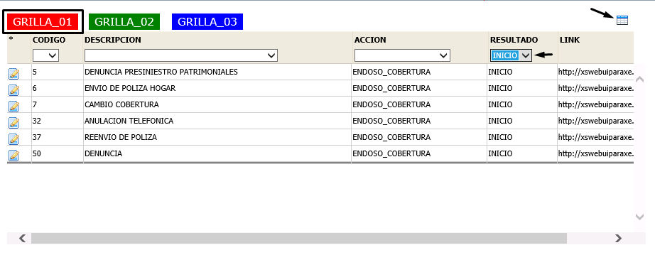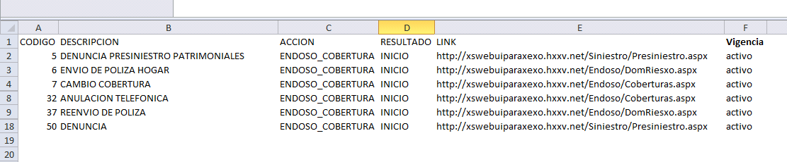
<br/>
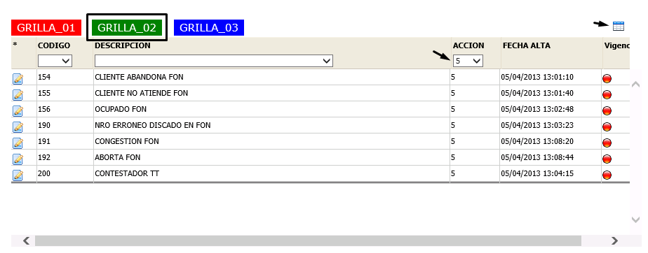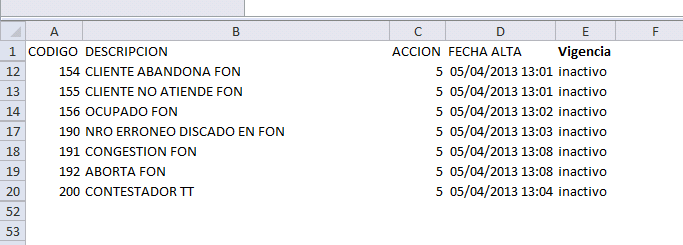
<br/>
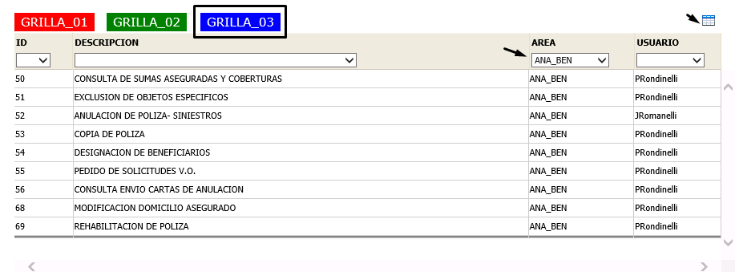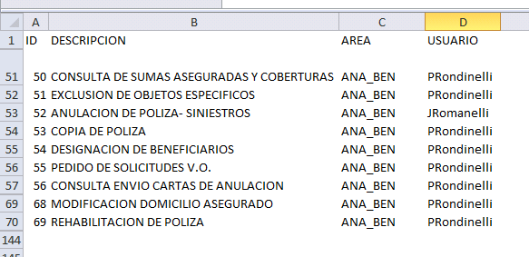
<br/>


